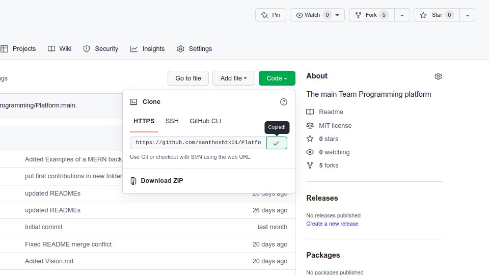
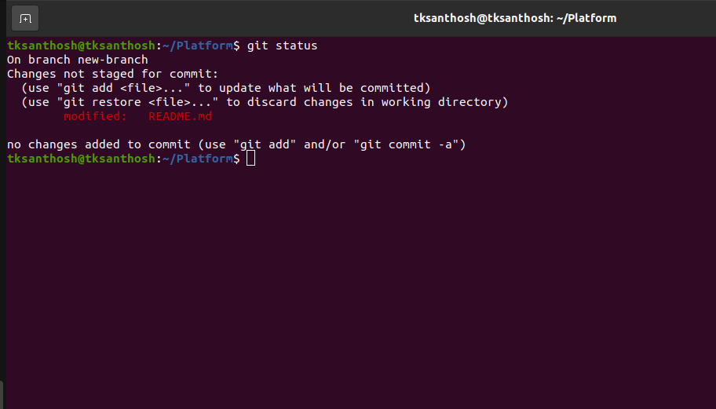
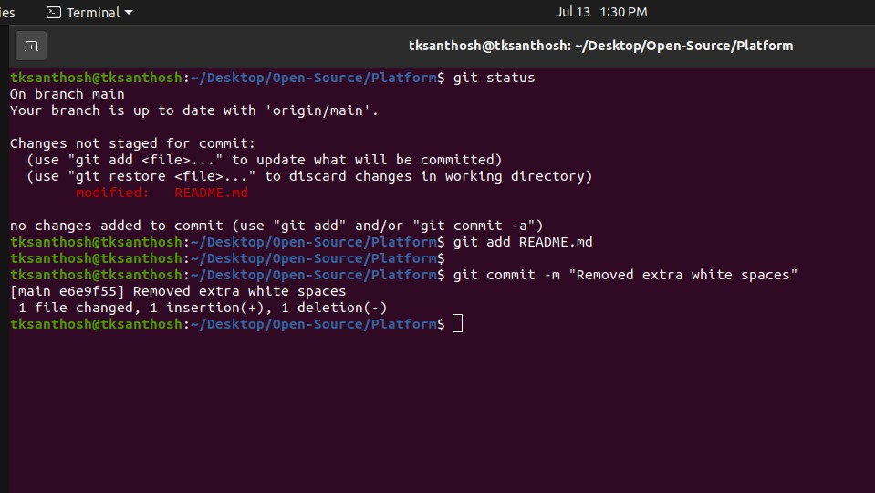
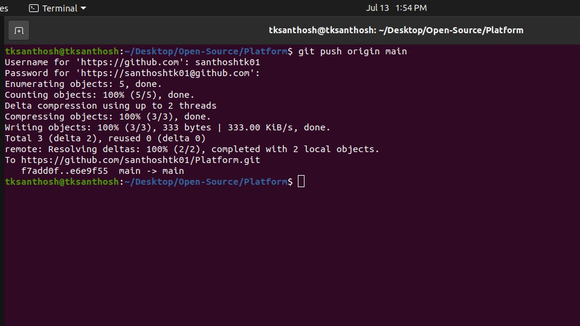
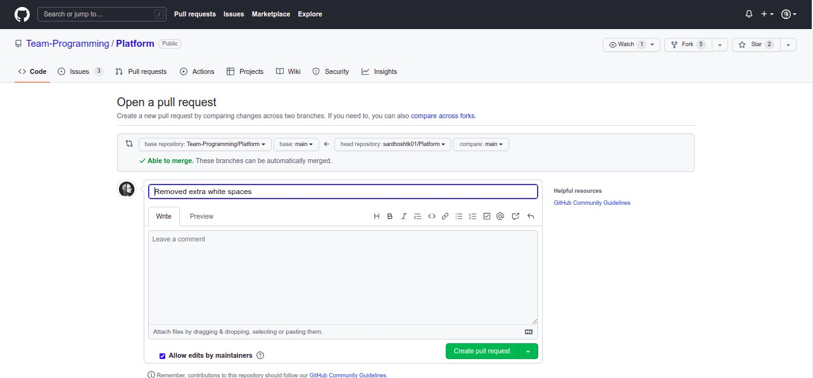

Hi everyone, first and foremost I would appreciate you for taking the first step towards Open Source contribution. To 
make contributions you have git  installed in your local system. Once you have installed the 
git on your local system configure it.

#### To install git in your local machine - [git](https://git-scm.com/)

# Forking the repository
To make contributions you first need to fork the repository into your GitHub account. To fork the repository into your
account on top right corner click the `fork` button.


# Cloning and Branching
You can get this hyperlink by **Repositories -> Code -> Copy the link**
- Clone this project into your local machine.
  ```
  $ git clone "link that you copied"
  ```
  

# Create a branch
- Create your own branch to make changes in the project without worrying about mistakes. Open `Terminal` in Linux. If you are in 
windows you can open the `git shell`. Change the working directory into the project using `cd folderName`. Then use `git branch`
to know about the branches.
  - To create a branch ```$ git branch branchName``` branch name can be any name you can create on your own.
  - Checkout the `main` repository into your created branch ```$ git checkout branchName```
  

# Make necessary changes and commit those changes.
## Checking the status of repo
- Once you made the changes, you can use the `git status` command to check the status of the 
repository.
  - To check the status of the repository.
    ```$ git status```


## Committing the changes
- Then you must add the files into the staging index and then make
a commit.
  - To add the files into the staging index.
    ```$ git add filename```
  - To commit the changes.
    ```$ git commit -m "A simple message about the commit"```


## Pushing the changes
- Now you all set, you can make any changes to the file without worrying about the mistakes. Because, changes that you 
make won't affect the original repository. Once you are ready to merge the changes into the original repository you can 
do it with `git push` command.
  - To merge the changes to the Original repository.
    ```$ git push origin branchName```
  


## Submit the changes for review
