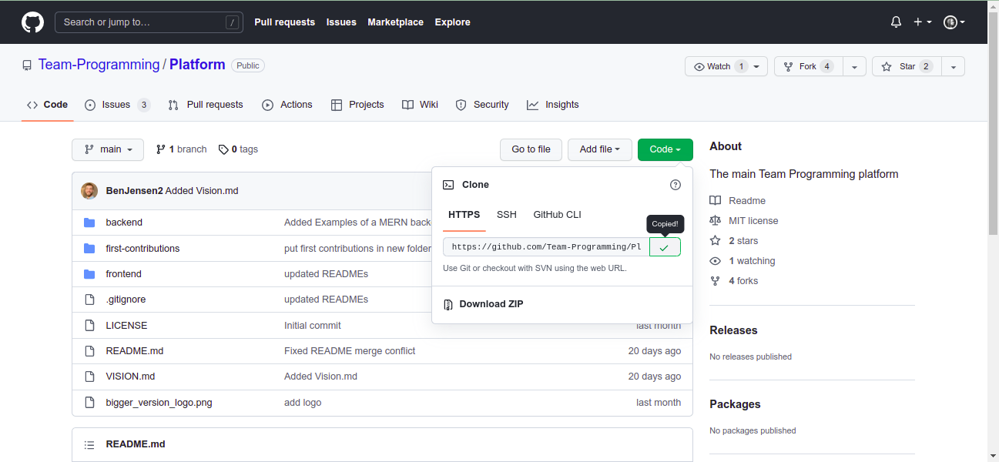
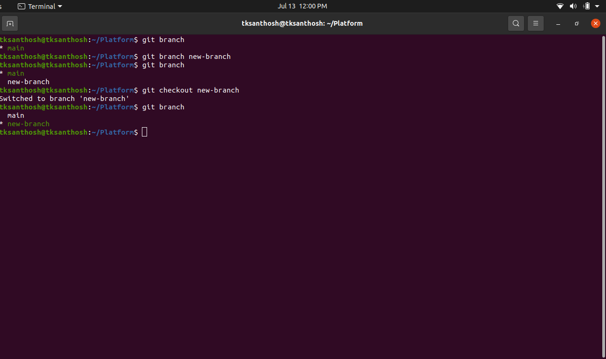

Hi everyone, first and foremost I would appreciate you for 
taking the first step towards Open Source contribution. 
To make contributions you have [git](https://git-scm.com/) 
installed in your local system. Once you have installed the 
git on your local system configure it.

- Clone this project into your local machine.

  ```
  $ git clone "https://github.com/Team-Programming/Platform.git"
  ```
  You can get this hyperlink by **Repositories -> Code -> Copy the link**
- Create your own branch to make changes in the project without worrying about 
mistakes. Open `Terminal`. If you are in windows you can open the `git shell`.
  - To create a branch ```$ git branch branchName``` branch name can be anyname you can 
create on your own.
  - Checkout the `main` repository into your created branch ```$ git checkout branchName```
